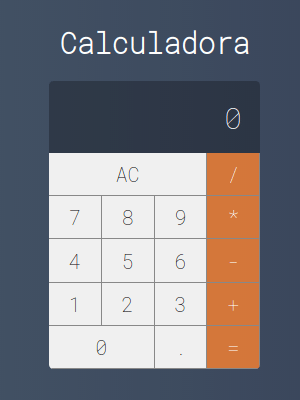

<h1 align="center" style="border-radius:100px">
  Calculadora - React
</h1>

</img>
<a href="https://github.com/marcelobiao/calculadora-react/blob/master/LICENSE">
    </img>
</a>

  

## :gear: Tecnologias

Esse projeto foi desenvolvido com as seguintes tecnologias:

- [React](https://reactjs.org)

## :computer: Sobre

O projeto consiste de uma calculadora funcional que abrange as operações fundamentais da matemática, como: adição, subtração, divisão e multiplicação.

## :memo: Licença

Esse projeto está sob a licença MIT. Veja o arquivo [LICENSE](LICENSE.md) para mais detalhes.

## :phone: Contato

Para dúvidas ou sugestões, as issues e pull requestes são sempre bem vindos, ou me envie uma mensagem pelo Discord (MarceloBiao#6673) para que possamos conversar :grin:.